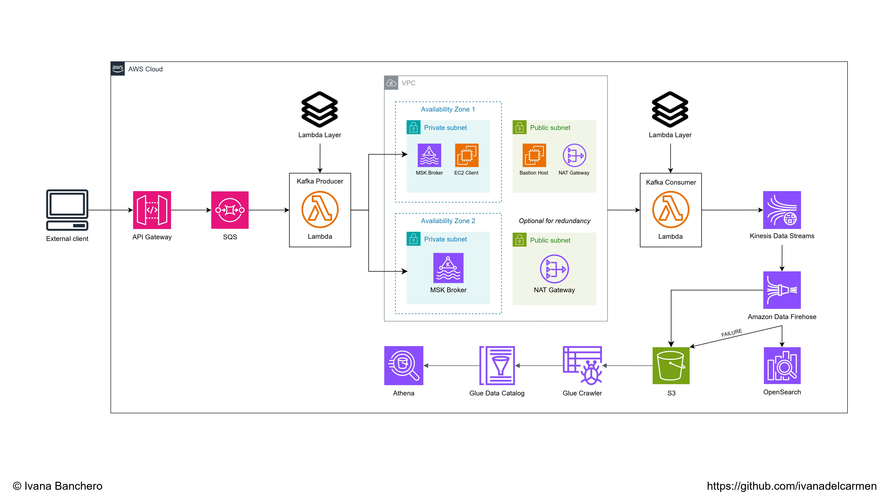

# **Data streaming and sentiment analysis with Reddit comments using Apache Kafka and AWS services**

## Abstract

The following program uses the `PRAW` (Python Reddit API Wrapper) library to collect incoming, real-time comments from Reddit, posted within a specific board called "subreddit", which are sent to AWS for further processing including sentiment analysis, querying, and visualization, using services like Lambda, MSK, and OpenSearch to name a few. The r/politics subreddit was chosen in this case due to its constant and rapid flux of comments, adequate for development purposes.

## Architecture

#

### Ingestion

Once the Reddit API polls for comments, starting a stream through the `app.py` file, they are sent using the POST method to an API Gateway URL in AWS. The code is designed to be executed locally, nonetheless in a production environment the code should buffer the messages before sending them to the API and be scheduled to run periodically for specific periods of time. This way, high costs regarding execution and HTTP requests can be avoided and leveraged.

Within AWS, as seen in the image above, messages are sent to an SQS queue which acts as a buffer between the MSK cluster and API Gateway, reducing coupling between components and providing resilient and fault-tolerant features at the same time. The incoming events to SQS trigger a Lambda function which acts as the Kafka producer in this architecture, running the `producer.py` file with correct environment variables, layer settings, IAM policies, and access to the VPC where the MSK cluster is running. It is important to note that the SQS queue has to have a visibility timeout greater than the Lambda producer's execution time to avoid possible duplicate processing, ensuring synchronism.

On the other hand, the MSK cluster can run with Plaintext encryption since its brokers are securely placed within private subnets. To access the cluster's configuration, however, an EC2 instance running in one of the private subnets is required. Also, since Apache Kafka has to be installed in the client machine, Internet traffic has to be mediated through a Bastion Host running in a public subnet of the same VPC. Traffic from the Internet requested by the private EC2 client must be routed to the NAT Gateway associated with the public subnet, which can be replicated optionally for redundancy in later processes.

#

### Transformation

Along with CloudWatch metrics, the Kafka console consumer script in the private EC2 client can be started to test whether messages from the Lambda producer are being published to the topic or not. Once they are properly received, messages will trigger the second Lambda function, acting as a Kafka consumer which runs the `consumer.py` file with a layer containing the `textblob` sentiment analysis library, correct environment variables, and adequate IAM policies. Lambda does not need access to the VPC in this stage because the NAT Gateway allows MSK to directly trigger the service. In this step, the incoming events are decoded and casted into a dict object, transformed with text formatting and sentiment analysis, and finally sent to Kinesis Data Streams.

#

### Analysis

Kinesis Data Streams is connected as a source to two Amazon Data Firehose streams: one sends data to an S3 bucket and the other one sends data to an index in an OpenSearch domain, using the same S3 bucket as a backup for failed data. The latter stream must have OpenSearch access policies attached and be mapped to a backend role with access within OpenSearch. Simultaneously, a Glue Crawler for the S3 bucket will be set up to query data in Athena. With both implementations, tasks of querying and real-time visualization can be done over the stream of Reddit comments. Additionally, S3 Lifecycle Rules can be applied to manage storage costs, transitioning data between storage classes or scheduling deletion.

#

### Related documentation

- [Integrate Amazon API Gateway with Amazon SQS to handle asynchronous REST APIs](https://docs.aws.amazon.com/prescriptive-guidance/latest/patterns/integrate-amazon-api-gateway-with-amazon-sqs-to-handle-asynchronous-rest-apis.html)

- [Create a topic in the Amazon MSK cluster](https://docs.aws.amazon.com/msk/latest/developerguide/create-topic.html)

- [Using Lambda with Amazon MSK](https://docs.aws.amazon.com/lambda/latest/dg/with-msk.html)